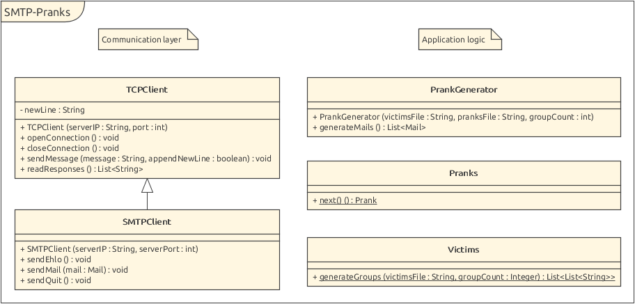

# SMTP Pranks [](https://travis-ci.org/nyg/smtp-pranks) [](https://codecov.io/gh/nyg/smtp-pranks)

## Description

From a list of emails, *SMTP Pranks* creates groups consisting of one sender and multiple recipients. *SMTP Pranks* then chooses a message and sends it to the recipients on behalf of the sender.

The list of emails, the groups sizes and the messages to be sent are all user-defined, making *SMTP Pranks* very flexible.

*SMTP Pranks* is a lab project for the *Network programming* course at the HEIG-VD. Its requirements are defined here: [SoftEng-HEIGVD/Teaching-HEIGVD-RES-2019-Labo-SMTP](https://github.com/SoftEng-HEIGVD/Teaching-HEIGVD-RES-2019-Labo-SMTP).

## Configuration

### `application.properties`

By default, *SMTP Pranks* comes with its own files (`application.properties`, `victims.txt` and `pranks.txt`). Of coure, it is possible to specifiy a different set of files.

First, it is necessary to specify the `application.properties` file. Its location can either be given by passing the system property `app.properties.location` when starting the JAR or by placing the file in the current working directory from which the JAR will be launched.

```sh
# using system property
$ java -Dapp.properties.location=/path/to/application.properties -jar smtp-pranks-1.0.0.jar
# or using current working directory
$ ls -1
application.properties
smtp-pranks-1.0.0.jar
$ java -jar smtp-pranks-1.0.0.jar
```

The `application.properties` file is then used to find the two other files (`victims.txt` and `pranks.txt`). It is also used to specify the SMTP server we want to send the mails to and the size of each group. Here is its default content:

```
app.server.ip             = 127.0.0.1
app.server.port           = 2525
app.file.pranks.location  = src/main/resources/pranks.txt
app.file.victims.location = src/main/resources/victims.txt
app.victims.groupCount    = 5
```

### Victims and Pranks File Format

The list of emails are to be defined in the `victims.txt` file, one email per line. The messages to be sent must be written in the `pranks.txt` file. The first line of a prank will be the subject of the email. Each prank is separated by three equal signs on a single line.

## Build and Run

To build *SMTP Pranks*, use [Maven](https://maven.apache.org):

```sh
$ mvn clean package
[INFO] Scanning for projects...
[INFO]
[INFO] ----------------------< ch.heig.res:smtp-pranks >-----------------------
[INFO] Building smtp-pranks 1.0-SNAPSHOT
[INFO] --------------------------------[ jar ]---------------------------------
...
[INFO] ------------------------------------------------------------------------
[INFO] BUILD SUCCESS
[INFO] ------------------------------------------------------------------------
[INFO] Total time:  5.439 s
[INFO] Finished at: 2019-04-08T21:51:17+02:00
[INFO] ------------------------------------------------------------------------
```

This will also run unit tests. An internet connection is required for them to succeed. Tests can be skipped using the `-Dmaven.test.skip=true` option. The built JAR is placed in the `target` directory. Run it with the following command:

```sh
$ java -jar target/smtp-pranks-1.0.0.jar
```

## Testing

When running *SMTP Pranks*, an SMTP server must be specified for the mails to be sent. Instead of using a real-world server, a mock one can be used. A mock SMTP server will not relay the mails it receives to other SMTP servers, instead, it keeps them so they can be viewed and analyzed, usually through a Web interface.

Two scripts to build and run a [MockMock](https://github.com/dc55028/MockMock) [Docker](https://www.docker.com) image are provided in the `docker` folder. Use the following commands to build and run the image:

```sh
$ cd docker
$ ./build-image.sh   # will clone and build MockMock as well as create the Docker image
$ ./run-container.sh # starts up the container for the Docker image 
```

The MockMock server listens to port 2525 on localhost and the Web interface can be access at [localhost:8282](http://localhost:8282).

## Architecture

### Class Diagram



### Classes Description

* A **`PrankGenerator`** instance takes the victims file, the pranks file and the group count value as input, and is then able to generate a list of `Mail` instances as output (through its `generateMails` method). To accomplish this, it uses the **`Pranks`** and **`Victims`** util classes, which only have one static method each. It is these two classes which will read the victims and pranks file.
* The `Mail` instances are then sent using an **`SMTPClient`** instance. Its `sendEhlo` method must first be called, then any number of mails can be sent using the `sendMail` method, finally the `sendQuit` method must be invoked. The `SMTPClient` class inherits from the **`TCPClient`** class which handles the socket-level communication with the server.
